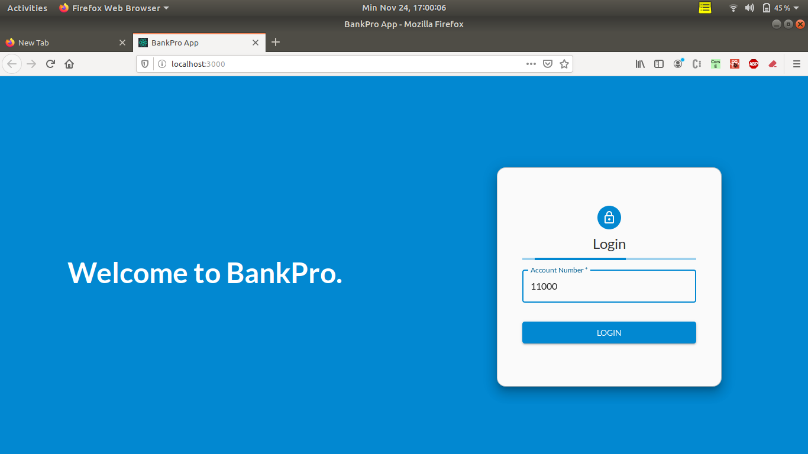
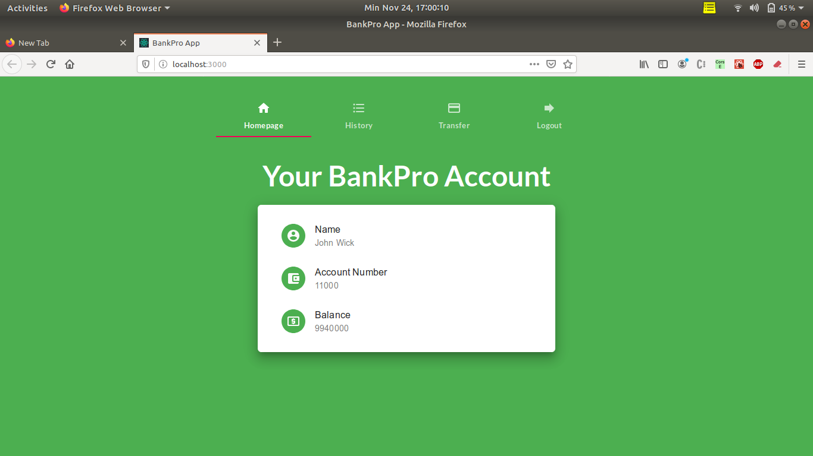
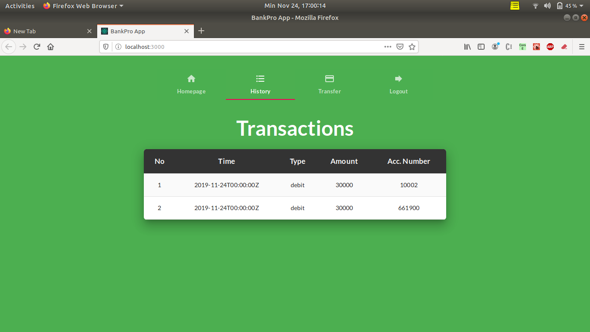
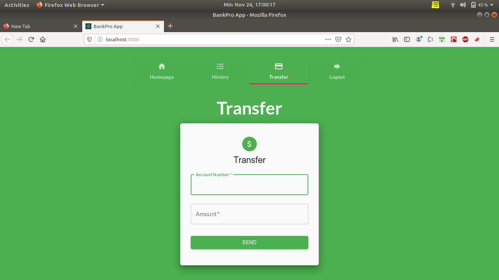

# Bank-Pro

## Deskripsi Aplikasi Bank
Apikasi web bank-pro dikembangakan menggunakan ReactJS. Aplikasi web bank-pro memiliki fitur :
1. Login
2. Melakukan Transfer
3. Melihat Riwayat Transaksi

## Screenshot Aplikasi Bank
1. Login

2. Home

3. Riwayat

4. Transfer

## Pembagian tugas WBD IF3110
### REST
1. Menambah transaksi baru : 13517096
2. Mengubah status transaksi : 13517108
3. Mengembalikan seluruh data transaksi : 13517021
4. Skema database : 13517108

### SOAP
1. Validasi no rekening : 13517021
2. Memberi data rekening nasabah : 13517096
3. Transaksi transfer : 13517108
4. Membuat virtual account : 13517021
5. Mengecek data transaksi : 13517096

### ReactJS
1. Template bank-pro : 13517021
2. Login : 13517021
3. Transfer : 13517096
4. Riwayat : 13517108

### Perubahan Engima
1. Pemgambilan data film ke home : 13517108
2. Detail film dan search : 13517108
3. Buy ticket : 13517021
4. Transaction history : 13517096
5. Transaksi tiket film : 13517021

### Untuk tugas DPPL IF3159 Bagian Bank-Pro
1. Continous Integration : Linting dan Testing 13517021
2. Eksplorasi EC2 : 13517021
3. Deployment BankPro ke EC2: 13517021
5. Continuous Deployment Pipeline: 13517021
6. URL deployment : ec2-52-204-222-118.compute-1.amazonaws.com/bankpro